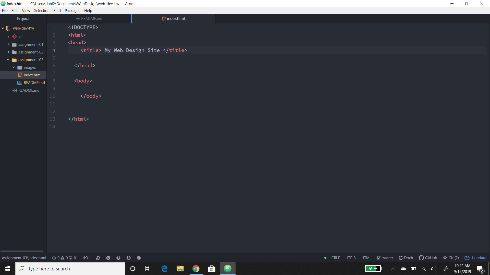

# Assignment 3
## Dani Briggs

1.Very briefly detail how browsers function. List any browsers you currently use to surf - or even develop for - the web.

A browser uses web languages like HTML, Css and JavaScript to create layouts of text, graphics and other elements that can be seen and used through out the page.

The main browsers I use are Chrome, Firefox and Edge.

2.What is a markup language? Describe one commonly used in development.

markup language is use to setup your web page. It helps you place your text, graphics and other elements. One commonly used language is HTML.

