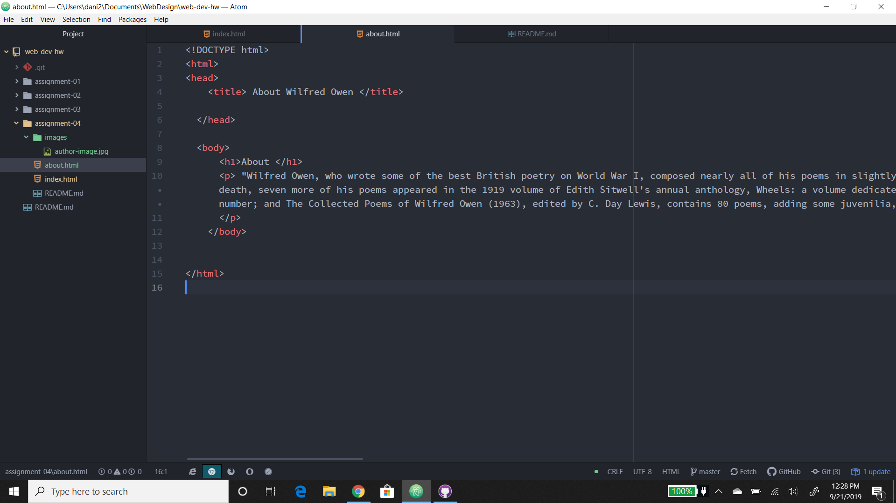

# Assignment 4
## Dani Briggs

1. The website I went to was cartoonnetwork.com. I was different from what I remembered but it had a the shows I watch when I was a kid. I had a light blue background that I don't remember. It still has a somewhat similar font and layout that It still has today.
2. It was pretty easy to use the GIT module. I've had other coding classes so, this was bascally a review.

