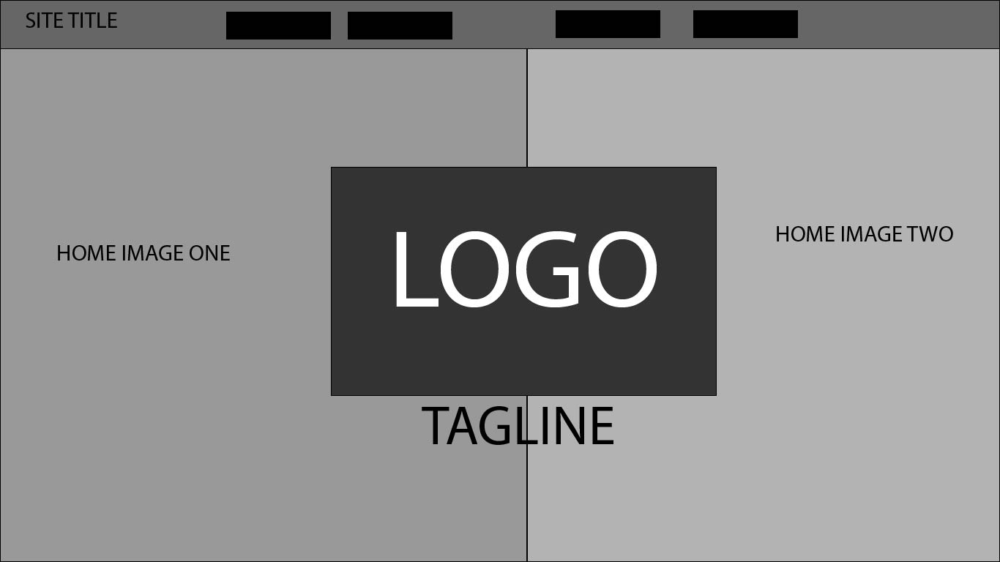

# Assignment 11
## Dani Briggs

What is the difference between padding, margin, and borders?

Borders go around the content. Padding is the space within the container. Margin is the space around the content with the borders and relative to the other content around it.

Free Response: Summarize your work cycle for this assignment.
I went through the content on the website.Looked at examples of websites. MAde my Sketch. Gathered materials like fonts and images. Finished Assignment and then did readme. 
